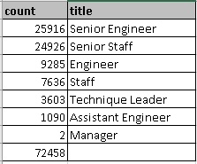
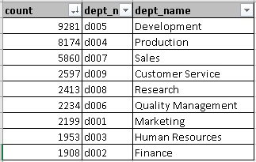
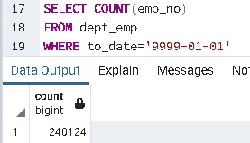

# Pewlett-Hackard-Analysis
## Overview
Pewlett-Hackard is expecting a large number of employees to retire soon.  Their records are currently kept in CSV files but they would like to update their record keeping system to SQL.  The data from the csv files were imported to SQL tables and within SQL, the employee data was analyzed to determine the employee retirement based on birth date and hire date.  Additionally, that data was broken down in to 

## Results
- There are 72,548 positions that will need to be filled over the next 5 years
- Senior Engineer, Senior Staff, and Engineer are the top 3 positions that will need to be filled. 

- The top 3 departments that will be affected by the retirements are Development, Production, and Sales. 

- There are 1,459 employees eligible to be a mentor. 

## Summary
### How many roles will need to be filled as the "silver tsunami" begins to make an impact?
Hewlett-Packard will need to fill 72,458 positions. 

### Are there enough qualified, retirement-ready employees in the departments to mentor the next generation of Pewlett Hackard employees?
According to the results, there are only 1,549 employees who are eligible to be a mentor.  Since there are over 72,000 employees retiring and therefore creating 72,000 positions to fill in the next 5 years.  Each mentor would need to train ~46 employees.  Based on this, it does not appear that Pewlett-Hackard will have enough mentors for the new wave hirees. 

### What positions do the mentorship eligible employees hold?
Senior Staff, Engineer, and Senior Engineer have the largest number of eligible mentors. 

### What percent of current employees are expected to retire?
There are 72,458 employees expected to retire out of 240124 current employees meaning ~30% of the workforce will be retiring. 

